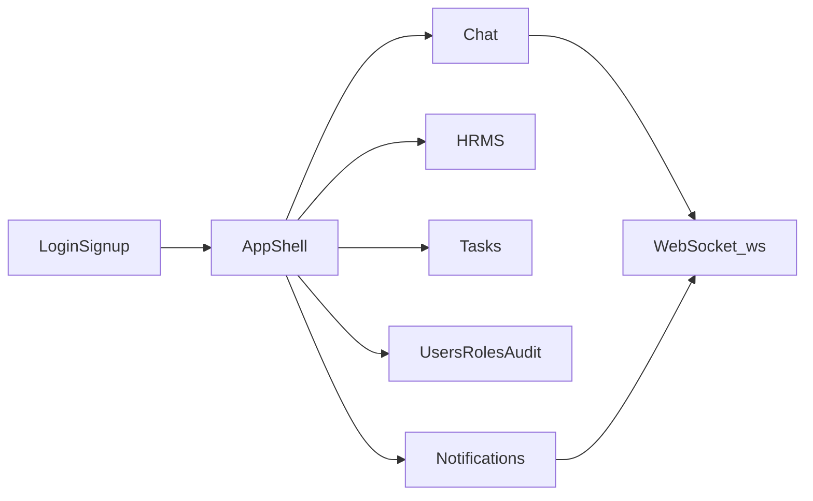

# Frontend — App shell (shared)

**Audience:** Frontend engineers implementing Chat, HRMS, Tasks, and Admin against this API.  
**Style:** Framework-agnostic. No React/Vue/Angular code.  
**Backend:** [Architecture overview](overview.md)

Read this before any feature frontend guide.

## Purpose

Define shared client contracts: auth session, identity, permission gating model, WebSocket connection, and response shapes. Feature guides assume these conventions.

## Screens and navigation

After login, the app shell exposes these areas (hide by capability — see Permission gating):

| Area | Logical route | Primary guides |
|---|---|---|
| Chat | `/chat` | [Chat frontend](../chat/frontend.md) |
| Notifications | `/notifications` (or shell bell) | [Notifications frontend](../notifications/frontend.md) |
| Tasks | `/tasks` | [Tasks frontend](../tasks/frontend.md) |
| HRMS | `/hrms/*` | [HRMS frontend](../hrms/frontend.md) |
| Admin — Users | `/admin/users` | [Users frontend](../users/frontend.md) |
| Admin — Roles | `/admin/roles` | [RBAC frontend](../rbac/frontend.md) |
| Admin — Audit | `/admin/audit` | [Audit frontend](../audit/frontend.md) |

Unauthenticated: `/login`, `/signup` — [Auth frontend](../auth/frontend.md).



## Identity

| Concept | Table | Used by UI |
|---|---|---|
| Login identity | `users` | Auth, chat membership, tasks (`created_by` / `assigned_to`), RBAC |
| HR identity | `employees` | All HRMS screens; `employees.user_id` → `users.id` (1:1) |

Same account powers Chat + HRMS + Tasks + Admin. Creating a user does **not** create an employee — HR links them later ([Employees frontend](../hrms/frontend-employees.md)).

On shell load after login:

1. `GET /api/v1/users/me` → current `UserOut`.
2. Optionally `GET /api/v1/hrms/employees/me/profile` when user has `employee.view` (SELF may still 403 if no employee row).

## Token lifecycle

Login/signup/refresh return `TokenResponse`:

```json
{
  "access_token": "...",
  "refresh_token": "...",
  "token_type": "bearer",
  "user": {
    "id": 1,
    "name": "Ada",
    "email": "ada@example.com",
    "status": "ACTIVE",
    "created_at": "...",
    "updated_at": "..."
  }
}
```

| Client responsibility | Detail |
|---|---|
| Persist | Store `access_token` + `refresh_token` securely (httpOnly cookie or secure storage — product choice) |
| Attach | `Authorization: Bearer <access_token>` on every REST call |
| Refresh | On `401`, call `POST /api/v1/auth/refresh` with `{ "refresh_token" }`, replace both tokens, retry once |
| Logout | `POST /api/v1/auth/logout` with Bearer; clear local tokens; close WebSocket |
| Inactive user | If user `status` is not `ACTIVE`, treat as logged out (API rejects protected routes) |

See [Auth frontend](../auth/frontend.md).

## Authorization model (UI)

Two patterns:

### 1. RBAC capability (+ HRMS scope)

Format: `resource.action` (e.g. `employee.view`, `leave_request.approve`).

For HRMS employee-scoped resources, each grant also has a data scope:

| Scope | Meaning for lists/detail |
|---|---|
| `SELF` | Only the actor’s employee row |
| `TEAM` | Direct reports (`manager_id` = actor’s employee id) |
| `ALL` | No employee restriction |
| `null` | Not employee-scoped (org config, users, roles, tasks, notifications) |

Scope-aware resources: `employee`, `attendance`, `leave_request`, `leave_balance`. Widest scope wins across roles: `ALL > TEAM > SELF`.

Reporting hierarchy (`employees.manager_id`) is independent of RBAC role names.

### 2. Tasks ownership

`task.*` permissions are **not** scope-aware. Visibility is always:

```text
created_by = me OR assigned_to = me
```

Field-aware PATCH rules apply (see [Tasks frontend](../tasks/frontend.md)).

### 3. Chat membership

Chat content uses conversation membership, not HRMS RBAC. Any authenticated user who is an active member can participate.

## Permission gating — known bootstrap gap

**Today:** `GET /api/v1/users/me` returns `UserOut` only — **no roles, no permission codes, no scopes**.

There is no `GET /users/me/permissions` (or equivalent) yet.

### Prescribe a client permission store anyway

Shape for when data is available (admin role editor, future bootstrap API, or temporary product convention):

```json
{
  "permissions": [
    { "code": "employee.view", "scope": "TEAM" },
    { "code": "department.view", "scope": null },
    { "code": "task.assign", "scope": null }
  ]
}
```

Helpers:

- `can(code)` → hide/disable controls.
- `scopeOf(code)` → choose SELF vs TEAM vs ALL UI (e.g. employee picker).

### Rules until a bootstrap API exists

1. **Server is source of truth** — always handle `403`; never assume a hidden button equals security.
2. Prefer gating UI by permission codes once bootstrap exists.
3. Temporary nav heuristics by seeded role name (`Admin`, `HR_ADMIN`, `MANAGER`, `EMPLOYEE`) are fragile — document any such mapping in the product layer, not as API contract.
4. Desirable backend follow-up: effective permissions for the current user (codes + resolved widest scope). Not part of this docs task.

Admin screens that list roles (`GET /api/v1/roles`) require `role.assign` and return full `RoleOut.permissions` — useful for **editing** roles, not for knowing the current user’s grants unless the user holds those roles and you also load their assignments (no self-assignment list API today).

## WebSocket (shared)

| Item | Value |
|---|---|
| Path | `WS /ws` (same origin as API; mounted beside `/api/v1`) |
| Auth | Query `?token=<access_token>` **or** `Authorization: Bearer <access_token>` |
| Reject | Close code `4401` if token missing/invalid/session revoked |
| Shared by | Chat realtime + `notification.created` |
| Heartbeat | Send `{ "event": "presence.heartbeat" }` periodically; expect `presence.update` |

Connect once after login; reconnect with backoff when access token refreshes or connection drops. Feature event catalogs: [Chat](../chat/frontend.md#realtime), [Notifications](../notifications/frontend.md#realtime).

## Response conventions (actual API)

Do **not** expect a global `{ "status", "message", "data" }` envelope. Routes return Pydantic DTOs directly.

| Pattern | Example |
|---|---|
| Single object | `UserOut`, `TaskOut`, `TokenResponse` |
| Array | `list[ConversationOut]`, `list[RoleOut]` |
| Cursor page | `{ "data": [MessageOut...], "next_cursor": 4951 \| null }` |
| Offset page (audit) | `{ "items": [...], "pagination": { "limit", "offset", "has_more", "total?" } }` |
| KPI | `TaskSummaryOut` with optional keys |
| Empty success | `204` on some deletes / role assign |
| Errors | FastAPI/HTTPException — typically `{ "detail": "..." }` or validation `422` body |

Interactive OpenAPI: `/docs` when the API is running. Endpoint index: [API reference](../api/reference.md).

## Client state (shell-level)

| Key | Notes |
|---|---|
| `access_token`, `refresh_token` | Session |
| `current_user` | From login or `/users/me` |
| `current_employee` | From `/hrms/employees/me/profile` when available |
| `permissions[]` | When bootstrap exists |
| `ws_connected` | Connection health |
| `notification_unread_count` | From REST + WS increments |

## Edge cases and non-goals

- No email/push — in-app notifications only.
- No punch/biometric/GPS attendance UI.
- Payroll/salary not in current phases.
- Workers/Celery are backend-only; UI only sees eventual consistency (e.g. message → inbox notification slight delay).

## Related guides

- Backend: [Architecture overview](overview.md)
- Features: [Auth](../auth/frontend.md) · [Users](../users/frontend.md) · [RBAC](../rbac/frontend.md) · [Chat](../chat/frontend.md) · [Notifications](../notifications/frontend.md) · [Tasks](../tasks/frontend.md) · [HRMS](../hrms/frontend.md) · [Audit](../audit/frontend.md)
