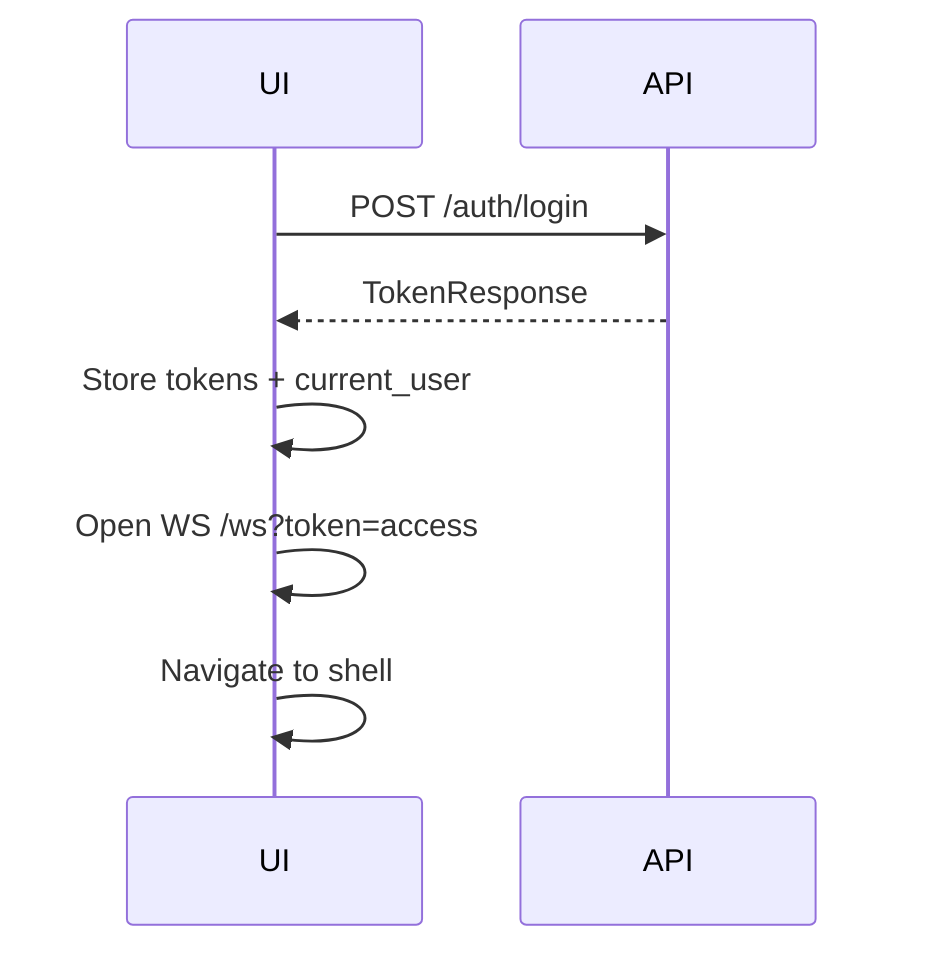

# Frontend — Auth

**Backend:** [Auth module](auth.md)  
**Base path:** `/api/v1/auth`  
**Shared shell:** [Architecture frontend](../architecture/frontend.md)

## Purpose

Unauthenticated entry (signup/login), token refresh, logout, and redirect rules when the session or user is invalid.

## Screens and navigation

| Screen | Logical route | Notes |
|---|---|---|
| Login | `/login` | Email + password |
| Signup | `/signup` | Name + email + password |
| (post-auth) | App shell | On success → main app |

No auth-specific RBAC codes — signup/login/refresh are public; logout requires Bearer.

## Primary flows

### Login



1. Submit email/password.
2. On success, persist `access_token` + `refresh_token` + `user`.
3. Connect WebSocket (see shell).
4. Navigate into app shell.

### Signup

Same as login, but `POST /auth/signup`. New users may receive default role `EMPLOYEE` (backend). Do not assume an HRMS employee row exists.

### Refresh

1. On REST `401` (or proactive expiry), call refresh once.
2. Replace both tokens from response.
3. Retry the failed request; if refresh fails → clear session → `/login`.

### Logout

1. `POST /auth/logout` with Bearer (best-effort if network fails).
2. Clear tokens and shell state.
3. Close WebSocket.
4. Navigate to `/login`.

## Permission gating

| UI | Rule |
|---|---|
| Login / Signup | Only when unauthenticated |
| Logout | Authenticated |
| App shell | Authenticated + user `ACTIVE` |

## API mapping

### `POST /api/v1/auth/signup`

**Auth:** none  

Request (`SignupRequest`):

```json
{
  "name": "Ada Lovelace",
  "email": "ada@example.com",
  "password": "at-least-8-chars"
}
```

| Field | Rules |
|---|---|
| `name` | 1–255 |
| `email` | valid email |
| `password` | 8–128 |

Response (`TokenResponse`): see [shell](../architecture/frontend.md#token-lifecycle).

Typical errors: `400`/`409` duplicate email; `422` validation.

### `POST /api/v1/auth/login`

**Auth:** none  

Request (`LoginRequest`):

```json
{
  "email": "ada@example.com",
  "password": "secret"
}
```

Response: `TokenResponse`.

Typical errors: `401` bad credentials; inactive/suspended users rejected by backend.

### `POST /api/v1/auth/refresh`

**Auth:** none (body carries refresh token)  

Request (`RefreshRequest`):

```json
{
  "refresh_token": "..."
}
```

Response: `TokenResponse` (rotated tokens). Treat old refresh as invalid after success.

Typical errors: `401` revoked/expired/unknown refresh.

### `POST /api/v1/auth/logout`

**Auth:** Bearer  

Response: success message / empty per API (`MessageResponse` or equivalent). Session `revoked_at` set server-side.

## Client state

| Key | Notes |
|---|---|
| `access_token` | Short-lived JWT (`sub` + `session_id`) |
| `refresh_token` | Opaque; send only to refresh |
| `current_user` | From `TokenResponse.user` or `GET /users/me` |

## Realtime

None for auth itself. After login, open shared `WS /ws` (shell).

## Edge cases and non-goals

- Access token alone is not enough if session is revoked — refresh/WS also fail.
- Do not keep using tokens after logout.
- Password reset / email verification / SSO — not in current API.
- Do not invent a global response envelope; use `TokenResponse` fields as returned.

## Related guides

- [Architecture frontend](../architecture/frontend.md)
- [Users frontend](../users/frontend.md) (`/users/me`)
- Backend: [auth.md](auth.md)
