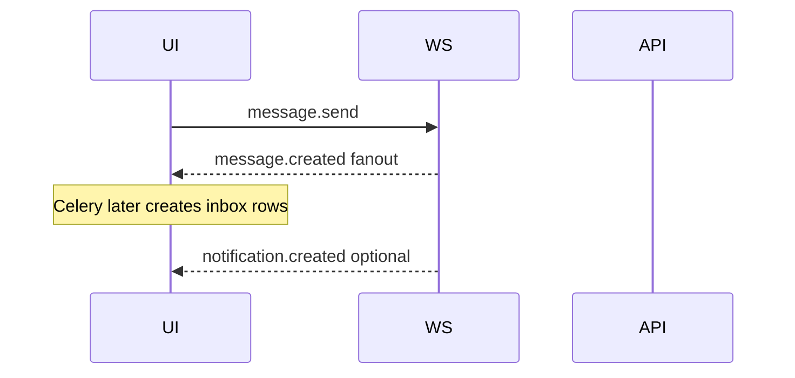

# Frontend — Chat

**Backend:** [Chat module](chat.md)  
**Base paths:** `/api/v1/conversations`, `/api/v1/messages`, `/api/v1/attachments`  
**Authz:** Conversation **membership** (not HRMS RBAC)  
**Shared shell:** [Architecture frontend](../architecture/frontend.md)

## Purpose

Realtime messaging: conversation list, DIRECT/GROUP threads, members, soft edit/delete, attachments, presence/typing/read, with a single shared WebSocket.

## Screens and navigation

| Screen | Logical route | Notes |
|---|---|---|
| Conversation list | `/chat` | Active memberships |
| Thread | `/chat/:conversationId` | Messages + composer |
| New DIRECT | `/chat/new/direct` | Pick one other user |
| New GROUP | `/chat/new/group` | Name + member_ids |
| Members panel | side panel on thread | Add/remove/leave |
| Attachments | composer flow | upload-url → PUT bytes → send |

Deep-link from notifications: `data.conversation_id` → open thread ([Notifications](../notifications/frontend.md)).

## Primary flows

### Open chat

1. Ensure `WS /ws` connected (shell).
2. `GET /api/v1/conversations` → list.
3. Select conversation → `GET .../messages` (cursor page).
4. On open/visible latest: send WS `message.read`.

### Send text (preferred: WebSocket)



Inbound:

```json
{
  "event": "message.send",
  "conversation_id": 12,
  "content": "Hello",
  "message_type": "TEXT",
  "reply_to_message_id": null,
  "attachment_id": null
}
```

Outbound (to members): `message.created` with full `message` object (`MessageOut`).

### Send file

1. `POST /api/v1/attachments/upload-url` with filename, mime_type, size.
2. `PUT /api/v1/attachments/{id}/upload` with file bytes.
3. WS `message.send` with `message_type: "FILE"`, `attachment_id`, and content (caption or filename as product chooses; content still required by schema).

### Create conversation

`POST /api/v1/conversations`:

```json
{
  "type": "DIRECT",
  "name": null,
  "member_ids": [42]
}
```

or GROUP with `name` + multiple `member_ids`. Response: `ConversationOut` including `members`.

### Load older messages

`GET /api/v1/conversations/{id}/messages?cursor=<next_cursor>&limit=...`  
Response: `{ "data": [MessageOut...], "next_cursor": number | null }`. Stop when `next_cursor` is null.

## Permission gating

No `chat.*` RBAC codes for content. Rules:

| Action | Who |
|---|---|
<<<<<<< HEAD
| Page | `pages/chat/index.vue` + `components/` |
| Store | `stores/chat/chat.js` |
| URLs | `conversations.*`, `messages.*`, `attachments.*`, `users.search` |
| Authz | Membership (not RBAC). Picker uses `GET /users/search?q=` (any authenticated user). |
=======
| List/open thread | Active member (`left_at` null) |
| Send / type / read | Active member |
| Add/remove members | Per backend membership roles (`OWNER` / `ADMIN` / `MEMBER`) — hide controls on 403 |
| Archive / rename | Same — respect API errors |
>>>>>>> b5047b43cbb0e144888c45fc015f9ac4463aec4e

Shell may show Chat for any authenticated user.

## API mapping

### Conversations

| Action | Method / path | Body / notes | Response |
|---|---|---|---|
| List | `GET /conversations` | — | `ConversationOut[]` |
| Create | `POST /conversations` | `ConversationCreate` | `ConversationOut` |
| Get | `GET /conversations/{id}` | — | `ConversationOut` |
| Rename | `PATCH /conversations/{id}` | `{ "name" }` | `ConversationOut` |
| Archive | `DELETE /conversations/{id}` | soft `archived_at` | per API |

`ConversationOut` fields: `id`, `type` (`DIRECT`|`GROUP`), `name`, `created_by`, `archived_at`, timestamps, `members[]`.

`MemberOut`: `id`, `conversation_id`, `user_id`, `role` (`MEMBER`|`OWNER`|`ADMIN`), `joined_at`, `left_at`, `last_read_message_id`, `user_name`, `user_email`.

### Members

| Action | Method / path | Body |
|---|---|---|
| List | `GET /conversations/{id}/members` | — |
| Add | `POST /conversations/{id}/members` | `{ "user_id", "role": "MEMBER" }` |
| Remove / leave | `DELETE /conversations/{id}/members/{user_id}` | soft leave |

### Messages (REST)

| Action | Method / path | Body | Response |
|---|---|---|---|
| History | `GET /conversations/{id}/messages` | cursor query | `CursorPage` |
| Get | `GET /messages/{id}` | — | `MessageOut` |
| Edit | `PATCH /messages/{id}` | `{ "content" }` | `MessageOut` (`edited_at`) |
| Soft delete | `DELETE /messages/{id}` | — | sets `deleted_at` |

`MessageOut`: `id`, `conversation_id`, `sender_id`, `message_type`, `content`, `reply_to_message_id`, `attachment_id`, `created_at`, `edited_at`, `deleted_at`.

### Attachments

| Step | Method / path | Body / response |
|---|---|---|
| Prepare | `POST /attachments/upload-url` | req: `{ filename, mime_type, size }` → `{ attachment_id, upload_url, storage_key }` |
| Upload | `PUT /attachments/{id}/upload` | raw bytes |

Typical errors: `403` not a member; `404`; `422` validation.

## Client state

| Key | Notes |
|---|---|
| `conversations` | List cache; update preview on `message.created` |
| `active_conversation_id` | Open thread |
| `messages_by_conversation` | Append from WS; prepend older pages |
| `next_cursor` | Per conversation |
| `typing_users` | From typing events |
| `online_user_ids` | From presence if product shows it |
| `draft` | Composer text / pending attachment_id |

## Realtime

Endpoint: `WS /ws` with `?token=` or Bearer (see shell). Close `4401` → refresh token / re-login.

### Inbound (client → server)

| Event | Required fields | Effect |
|---|---|---|
| `presence.heartbeat` | — | Direct reply `presence.update` |
| `typing.start` / `typing.stop` | `conversation_id` | Fanout same event to members |
| `message.read` | `conversation_id`, `message_id` | Persist read cursor; fanout |
| `message.send` | `conversation_id`, `content`; optional `message_type`, `reply_to_message_id`, `attachment_id` | Persist; fanout `message.created` |

Unknown event → `{ "event": "error", "detail": "..." }`.

### Outbound (server → client)

| Event | Payload highlights |
|---|---|
| `presence.update` | `user_id`, `status` |
| `typing.start` / `typing.stop` | `conversation_id`, `user_id`, `recipients` |
| `message.read` | `conversation_id`, `user_id`, `message_id` |
| `message.created` | `conversation_id`, `message_id`, `message` (MessageOut JSON), `recipients` |
| `notification.created` | See [Notifications](../notifications/frontend.md) — same socket |
| `error` | `detail` |

UI should ignore events for conversations not currently relevant, but still update list previews for `message.created`.

## Edge cases and non-goals

- Soft-deleted messages: show tombstone when `deleted_at` set; do not remove id from thread order without product decision.
- Archived conversations: hide from default list or show archived section.
- Message notifications are async (Celery) — unread badge may lag slightly after send.
- HRMS must not write chat tables; do not couple leave UI to chat APIs.
- No email/push for chat.

## Related guides

- [Notifications frontend](../notifications/frontend.md)
- [Architecture frontend](../architecture/frontend.md)
- Backend: [chat.md](chat.md)
